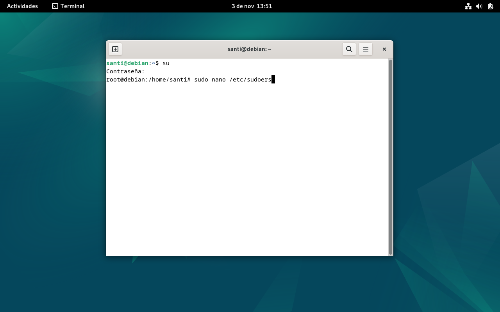
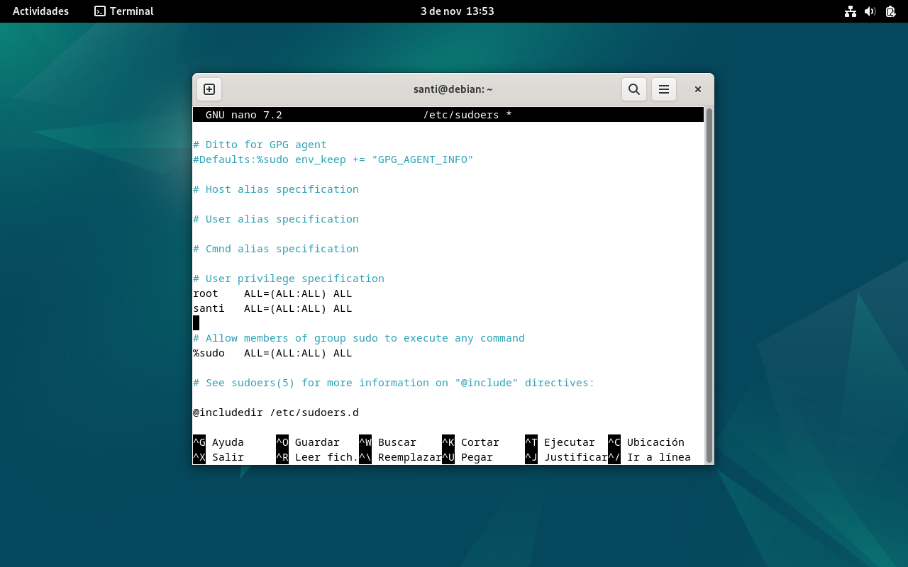
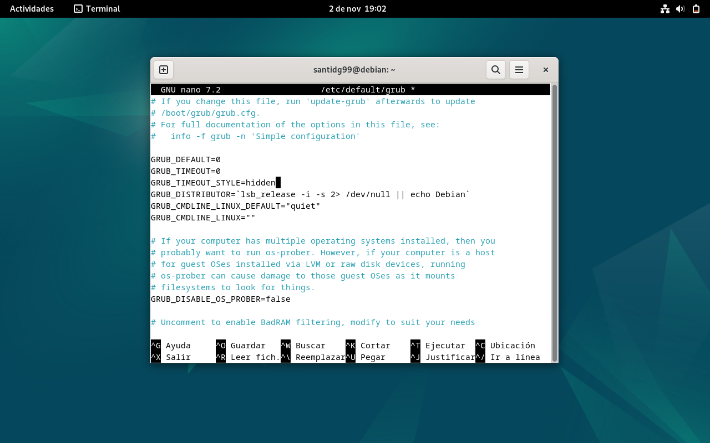
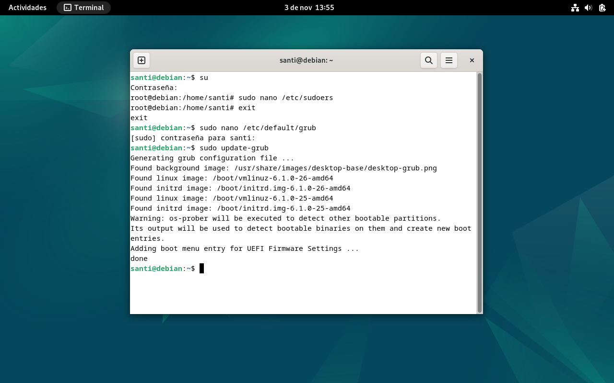
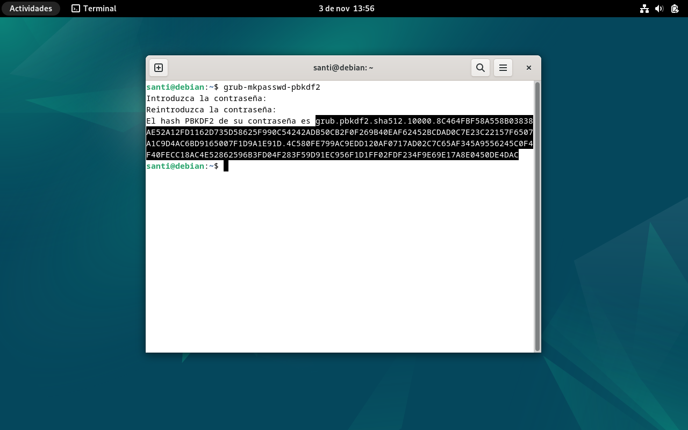
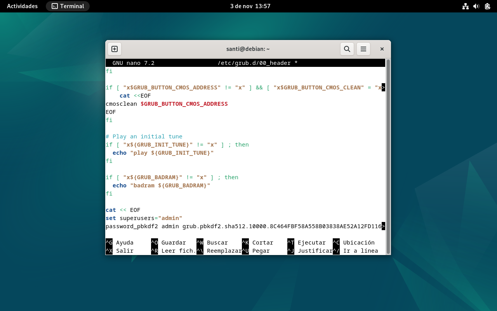
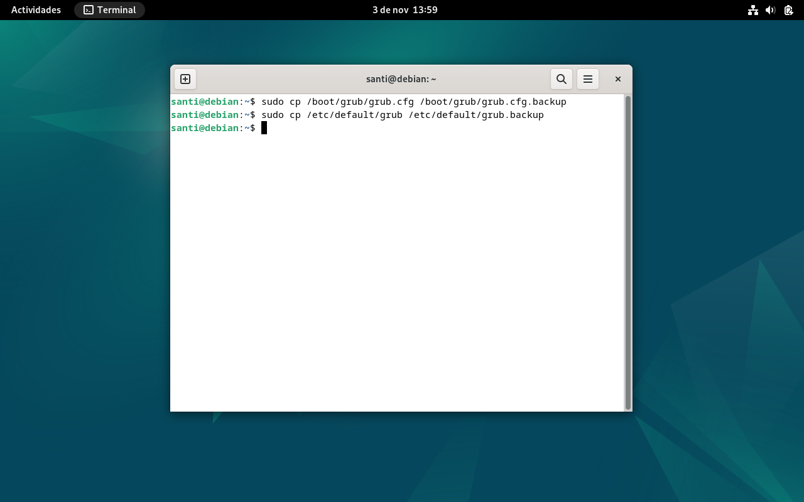
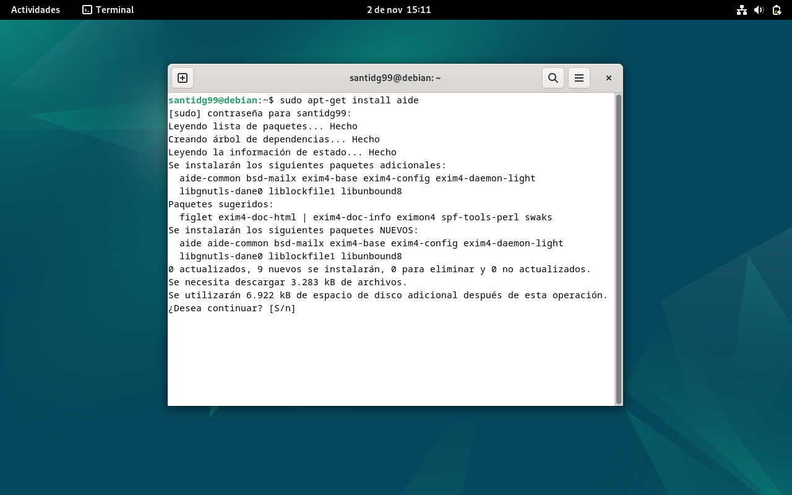

author: Santiago Domínguez Gómez
summary: Guía para bastionado del arranque de Debian 12
id: arranqedebian12
categories: debian,arranque
environments: Web
status: Published
feedback link: 
 


# Bastionado arranque Debian 12 

## Introducción


A continuación se muestra una guía para bastionar el arranque de un sistema Debian 12, en la cual se indica lo que debemos hacer para impedir que un ciberatacante pueda alterar la secuencia de arranque e inflingir daños en el sistema.


## Añadir usuario como root
Antes que nada deberemos acceder a la terminal y registrar nuestro usuario como root.

Para ello introduciremos el comando 
```
sudo nano /etc/sudoers
```
y una vez dentro del menú de configuración escribiremos nuestro nombre de usuario y le otorgaremos los permisos de administrador.




## Ocultación del arranque
A continuación explicaremos cómo ocultar el menú de GRUB para así dificultar su manipulación.

Empezaremos introduciendo el comando 
```
sudo nano /etc/default/grub
``` 
en la terminal para editar el archivo de configuración de GRUB, donde modificaremos las siguientes líneas:
```
GRUB_TIMEOUT=0
GRUB_TIMEOUT_STYLE=hidden 
```



```
NOTA: Deberemos también descomentar GRUB_DISABLE_OS_ORDER=false para poder guardar los cambios
```

Una vez hecho esto guardaremos los cambios y actualizaremos GRUB haciendo uso del comando 
```
sudo update-grub
```


Esto ocultará el menú de GRUB y arrancará directamente el sistema operativo predeterminado.

## Contraseña de arranque
A continuación crearemos una contraseña para proteger el acceso al menú de GRUB.

Primero generaremos una contraseña cifrada mediante el comando
```
grub-mkpasswd-pbkdf2
```


Ahora copiaremos esa contraseña cifrada (texto seleccionado en la foto) e introduciremos el comando 
```
sudo nano /etc/grub.d/00_header
```
para editar el archivo de configuración, donde añadiremos las siguientes líneas:
```
cat << EOF
set superusers="admin"
password_pbkdf2 admin <contraseña_cifrada>
```


Por último actualizaremos GRUB nuevamente con el comando 
```
sudo update-grub
```
A partir de ahora se pedirá una contraseña para modificar las entradas de arranque.

## Copia de seguridad
Es muy importante realizar una copia de seguridad de la configuración de GRUB para poder recuperar esta última si ocurre cualquier incidente.

Con este fin, crearemos una copia del archivo de configuración introduciendo el comando
```
sudo cp /boot/grub/grub.cfg /boot/grub/grub.cfg.backup
```
y posteriormente haremos una copia de la configuración personalizada con el comando
```
sudo cp /etc/default/grub /etc/default/grub.backup
```


Deberemos guardar estas copias en un lugar seguro, preferiblemente en un dispositivo externo.

## Otras opciones de seguridad
Para reforzar aún más la seguridad del arranque recomendamos realizar las siguientes acciones:

### Realizar cifrado del disco
Durante la instalación de Debian tendremos la opción de utilizar LUKS (Linux Unified Key Setup-on-disk-format) para cifrar las particiones del sistema, lo que evitará el acceso no autorizado a los datos del disco.

Accediendo al siguiente enlace podremos seguir un tutorial en el que se explicará cómo realizar los procesos de particionado y cifrado:
<https://www.zeppelinux.es/como-instalar-debian-10-con-particiones-cifradas-con-luks/>
```
NOTA: Es un tutorial para Debian 10, pero igualmente nos servirá para Debian 12.
```

### Utilizar AIDE
Advanced Intrusion Detection Environment (AIDE) es una utilidad que crea una base de datos de archivos en el sistema, y luego utiliza esa base de datos para asegurar la integridad de los archivos y detectar intrusiones en el sistema.

Para instalar AIDE accederemos a la terminal e introduciremos el comando
```
sudo apt-get install aide
```


Y, por supuesto, 
### Actualizar regularmente GRUB y el kernel
Esto permitirá corregir vulnerabilidades de seguridad en nuestro sistema.
